 

 

## 🧠 About

**Lead AI Developer** — production AI infrastructure by day, **neural networks rebuilt from scratch** by night, so I actually understand what I ship.

<b>Full-Stack Engineer&nbsp; ➜ &nbsp;Product Discovery Lead&nbsp; ➜ &nbsp;Lead AI Developer</b>

 

Four directions, one method: build it myself first, then trust the tool.

- 🔬 &nbsp;**Research** — I rebuild modern architectures **from first principles**: no `nn.Transformer`, no wrapper I can't explain.
- 🤖 &nbsp;**Work** — I lead a private, multi-tenant **AI platform**: composable agents + RAG over a customer's own documents, in production.
- 🎮 &nbsp;**Games** — a **Godot** game shipped on Steam, a one-person studio (**Pinguinista**) with the next one in production, and a degree in **hardware / electronics**.
- 🧰 &nbsp;**Tools** — for working with coding agents without losing seniority: *Seniority Rounds*, opening soon.
- 📚 &nbsp;Permanent student, pushing from LLMs toward **CUDA** and **quantum**.

---

## 🔬 Research — LLMs from scratch

The modern stack rebuilt one self-checking component at a time, in PyTorch, on a single RTX 3090.

<table>
<tr>
<td width="34%" valign="top">
 <a href="https://github.com/LeonelSalvo/modern-nanoGPT"><b>modern-nanoGPT</b></a> 
dense transformer · RMSNorm · RoPE · SwiGLU · GQA  

</td>
<td valign="top">
 <b>The modern dense transformer.</b> The GPT-2 skeleton upgraded to the 2026 open-weight stack — <b>RMSNorm · RoPE · SwiGLU · GQA · tied weights</b> — built one self-checking component at a time. Trained on a single RTX 3090 (val ≈ 1.48).
</td>
</tr>
<tr>
<td valign="top">
 <a href="https://github.com/LeonelSalvo/nano-moe-mla"><b>nano-moe-mla</b></a> 
sparse MoE + MLA · routing probe · ablation  

</td>
<td valign="top">
 <b>The sparse template: MoE + MLA in one model.</b> Built from scratch with the instruments to study it — a labeled multi-domain corpus, a router-specialization probe (mutual information), and a <b>seed-averaged stack ablation</b> that confirms the balancing ↔ specialization tradeoff.
</td>
</tr>
<tr>
<td valign="top">
 <a href="https://github.com/LeonelSalvo/frontier-llm-techniques-2026-Q1"><b>frontier-llm-techniques-2026-Q1</b></a> 
Muon · Multi-Token Prediction · BPE  

</td>
<td valign="top">
 <b>Frontier techniques, from scratch.</b> The <b>Muon</b> optimizer (used to train Kimi K2) and <b>Multi-Token Prediction</b> (DeepSeek-V3, Gemma 4, GLM, Qwen), plus a base <b>BPE</b> tokenizer — each self-contained and self-checking, with an AdamW-vs-Muon benchmark.
</td>
</tr>
</table>

---

## 🤖 Work

> I lead a private, multi-tenant enterprise AI platform — composable agents and retrieval over a customer's own documents, shipped to production. *(Architecture kept private.)*

---

## 🎮 Games — Pinguinista

<table>
<tr>
<td width="34%" valign="top">
 <b>🐧 Pinguinista</b> 
my one-person game studio
</td>
<td valign="top">
 <b>Next game: TBD.</b> In silent production — more when there is something to show.
</td>
</tr>
</table>

---

## 🧰 Tools — for working with coding agents

<table>
<tr>
<td width="34%" valign="top">
 <b>🃏 Seniority Rounds</b> 
TypeScript · React · three.js · a JSON contract any agent can write
</td>
<td valign="top">
 <b>Avoid atrophy.</b> Understand what your agents are producing, in a didactic, learning-in-the-loop way — cards, not diffs. The agent says what it wasn't sure about and what you didn't ask for; you predict before you look. <i>Stay senior on what your agents are producing.</i>
</td>
</tr>
</table>

🔒 Private while I polish it — opening soon.

---

## 🧬 Reproduced from scratch

I didn't invent these — I learned them by **rebuilding and verifying each one in code**, following Karpathy's *Zero to Hero* and the open-model papers.

| Built | What it is | Learned from |
|---|---|---|
| **micrograd** | a tiny autograd engine — backprop by hand | Karpathy · *Zero to Hero* |
| **makemore** | MLP, BatchNorm, manual backprop, WaveNet | Karpathy · *Zero to Hero* |
| **self-attention** | the attention mechanism, from the math up | *Attention Is All You Need* |
| **modern-nanoGPT** | the modern dense transformer (RMSNorm · RoPE · GQA · SwiGLU) | nanoGPT + Llama / Mistral / Qwen |
| **nano-moe-mla** | sparse MoE + MLA in one model, with a routing probe + ablation | DeepSeek-V2/V3 papers |
| **Muon optimizer** | orthogonalized-momentum (Newton-Schulz) + a benchmark | Keller Jordan · Moonshot (Kimi K2) |
| **Multi-Token Prediction** | a 2nd head predicting t+2 — a denser training signal | DeepSeek-V3 |
| **BPE tokenizer** | byte-pair encoding, exact round-trip | Karpathy · *minBPE* |

Method: from-scratch first; a wrapper is only allowed once I can name what it wraps and the trade-off.

---

## 📖 Learning path

<table>
<tr><td valign="top" width="50%">

**✅ Done**
- Karpathy — **Neural Networks: Zero to Hero** (10/10)
- Stanford **CS229** — Machine Learning (Andrew Ng)
- **fast.ai** — Practical Deep Learning, Part 1

</td><td valign="top" width="50%">

**🔄 In progress**
- **Hugging Face — LLM Course** (transformers, fine-tuning, reasoning)
- Reinforcing **attention internals** (RoPE · KV-cache · RMSNorm)

</td></tr>
<tr><td valign="top">

**⏭️ Next**
- **nanochat** (Karpathy) — the full ChatGPT pipeline
- Raschka — **Build a Reasoning Model (From Scratch)**

</td><td valign="top">

**🧪 Later**
- **Triton → GPU-MODE + PMPP** (CUDA kernels)
- Mamba / SSM hybrids · Diffusion LLMs · Quantum

</td></tr>
</table>

---

## 🛠️ Stack

**AI / ML** &nbsp;

**Backend** &nbsp;

**Frontend** &nbsp;

**Infra & also** &nbsp;

---

## 📊 Stats

  

